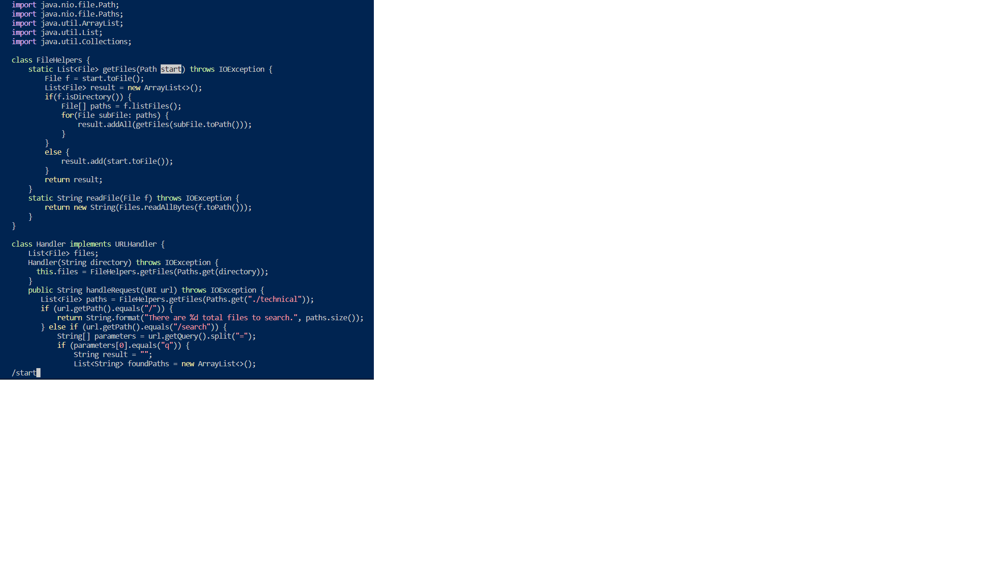
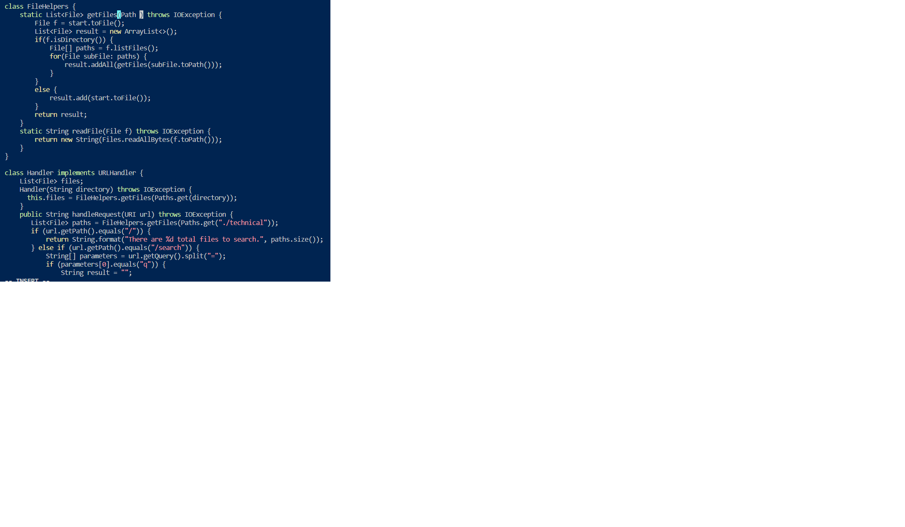
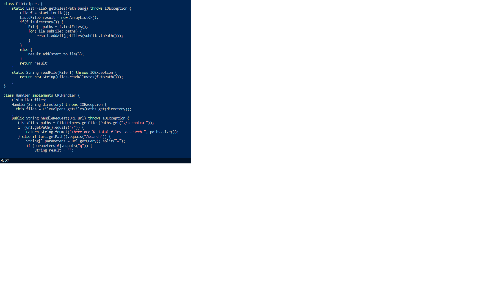
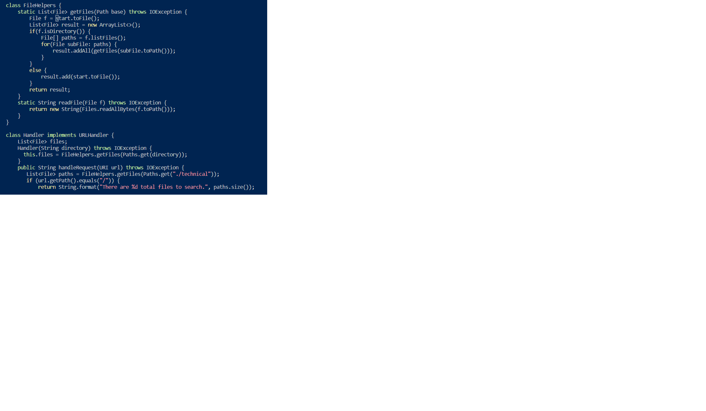

#  Week 7 Lab
### *Acknowledgement: Thanks to Timothy Ngyuen, my classmate at CSE 15L who gave me generous help in this lab report by teaching me how to complete Part 1 using shortcuts such as "." and "n".*

 

# **Part 1**
## Changing the name of the start parameter and its uses to base:
## Keys pressed:  
## 1. `/start + < Enter >`: This command search for the word "start" in the file. We may press < Enter > to save the searched word. Please see the screenshot for this set of commands:
  

 

## 2. `c + e`: Firstly, I pressed "c", which means change, and "e", which will change and delete until the end of the word that the cursor is on. This set of commands also put my terminal to the insert mode. 

 

## 3. `b + a + s + e + < Esc >`: After deleting "start", I typed its replacement, "base" by pressing keys "b", "a", "s", and "e." Finally, I pressed < Esc > to exit the insert mode and go back to the normal mode. 

## 4. `n`: I pressed "n" to go to the next searched "start". 

 

## 5. `.`: I pressed "." to repeat the previous commands of deleting "start" and replacing it with "base".

 

## 6. `n`: I pressed "n" to go to the next searched "start".

 

## 7. `.`: repeat previous commands of deleting "start" and replacing it with "base". This is the last command I need to do.

 

## ***End of Part 1***

 

# **Part 2**

## 1. Editing by the first style took me 65 seconds. 
## 2. Editing by the second style took me 45 seconds. 

 

## Below are my answers to the two questions:
## 1. Which of these two styles would you prefer using if you had to work on a program that you were running remotely, and why?
- ## - I prefer to use the second style because Vim's shortcuts such as "." and "/" will save me more time than the first style.

 

## 2. What about the project or task might factor into your decision one way or another? (If nothing would affect your decision, say so and why!)
- ## - If the task requires me to make a few edits, I may consider doing this on Vim because its shortcut does save me more time. However, if I need to make a lot of edits, I would prefer the first style because it will be more quickly and comfortable to use my mouse to make these edits. 

 

## ***End of Part 2***

 

## ***Thanks for reading it and see you!***